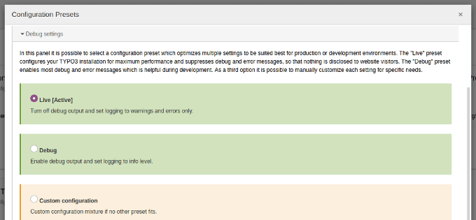

# Debug Settings Task

This TYPO3 extension resets TYPO3 debug settings to the »live« preset on
production using a scheduler task.

## Vision

“Better safe than sorry”.

This extension helps to make shure that debug settings are correct on
production stages.

If the debug mode was activated on a production stage for whatever reason,
the package resets the configuration automatically.

- Trigger the TYPO3 configuration presets and don't just overwrite
  settings in LocalConfiguration.php
- Use the scheduler to let integrators configure execution times in the TYPO3
  backend or disable the task during maintenance
- Only react to application context »Production«

## Requirements

- PHP
- TYPO3

## Installation

Packagist Entry https://packagist.org/packages/webit-de/debug-settings-task/

Add a scheduler task with the »debug_settings_task« extension.

Recommendation: Run the task at least daily.

## Source

https://github.com/webit-de/typo3-debug_settings_task/

## License

GNU General Public License version 2 or later

The GNU General Public License can be found at http://www.gnu.org/copyleft/gpl.html.

## Author

Marco Grahl (<grahl@webit.de>)
for webit! Gesellschaft für neue Medien mbH (http://www.webit.de/)

## Changelog

[./CHANGELOG.md](./CHANGELOG.md)

## Contribution

> TYPO3 - inspiring people to share!

This TYPO3 extension is Open Source, so please use, patch, extend or fork it.
