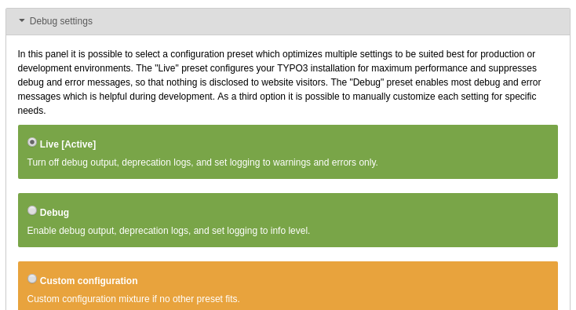

Debug Settings Task
===================

This TYPO3 extension sets the live preset for debug settings with a task, 
if system is in production context.

If the debug mode was activated on a production stage, it will be reset 
to the »live« preset in the install tool, every time the task runs.

Requirements
------------

* PHP
* TYPO3

Installation
-------------

Packagist Entry https://packagist.org/packages/webit-de/debug-settings-task/

Source
------

https://github.com/webit-de/typo3-debug_settings_task/

License
-------

GNU General Public License version 2

The GNU General Public License can be found at http://www.gnu.org/copyleft/gpl.html.

Author
------

Marco Grahl (<grahl@webit.de>)
for webit! Gesellschaft für neue Medien mbH (http://www.webit.de/)

Changelog
---------

[./Changelog.md](./Changelog.md)

Contribution
------------

> TYPO3 - inspiring people to share!

This TYPO3 extension is Open Source, so please use, patch, extend or fork it.
